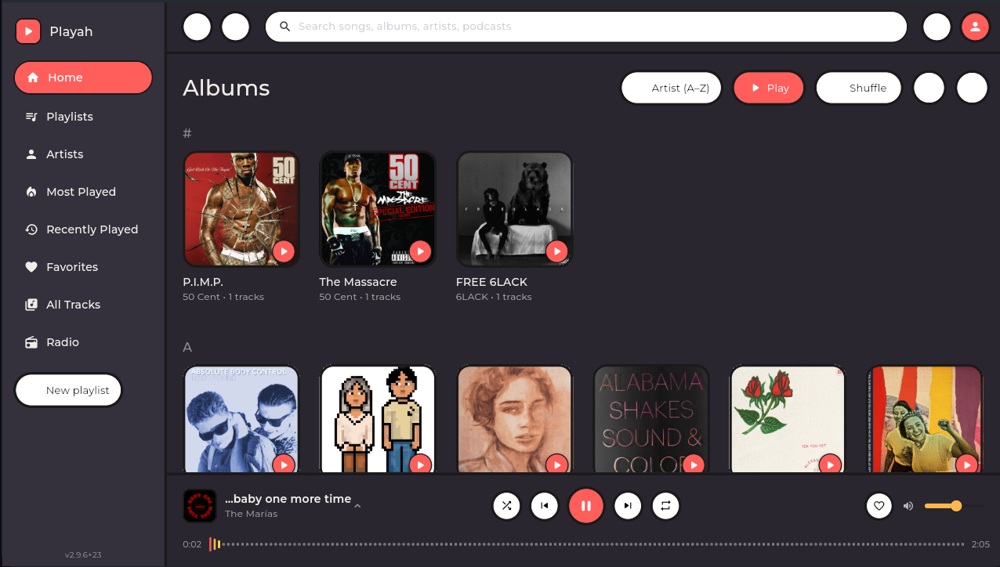

# Playah

A cartoon-styled, fully local music player built with Flutter. Playah scans your
own folders for audio files, reads their embedded metadata and artwork, and
gives you a chunky, hand-drawn-icon interface to browse, play, and organize
your library — no streaming account, no subscription, all playback local.



> Built entirely through vibe coding — every line written by prompting an AI assistant.

## Features

**Library & playback**
- Scans local folders for `.mp3`, `.flac`, `.wav`, `.m4a`, `.aac`, `.aif`/`.aiff`
- Reads embedded metadata (title, artist, album, artwork, release year) and lyrics
- Album grid home screen with per-album Play/Shuffle
- Sidebar navigation: Albums, Playlists, Most Played, Recently Played, Favorites, All Tracks
- Edit a track's metadata by hand, or autofill it from MusicBrainz (with cover art from the Cover Art Archive)
- Play Next / Add to Queue, drag-to-reorder queue, favorite/add-to-playlist per row
- Resumes the last-playing track, queue, and shuffle/repeat state on relaunch
- Background playback on Android via a foreground media service, with lock screen/notification controls

**Now Playing**
- Full-bleed album artwork with a synced lyrics panel (embedded, or fetched from lrclib.net as a fallback)
- Colorful animated "waveform" seek bar with shuffle/prev/play-pause/next/repeat transport controls
- Responsive layout: two-column on wide windows, stacked on narrow ones

**YouTube Music import**
- Paste a YouTube (Music) playlist link to stream it as a real Playah playlist
- Or download it permanently as local mp3s via yt-dlp, for offline playback

**Theming**
- Fully custom theme (background, sidebar, accent, text colors), optional background image, plus built-in preset palettes

**Platforms**
- Linux desktop, with a proper `.desktop` launcher and custom app icon
- Android (tested on a Samsung Galaxy A13)
- Original hand-drawn rock-hand/flame/headphones icon

See [FEATURES.txt](FEATURES.txt) for the full, detailed changelog.

## Getting started

This is a standard Flutter project.

```bash
flutter pub get
flutter run            # or: flutter run -d linux / -d android
```

To build a release binary:

```bash
flutter build linux --release   # bundle at build/linux/x64/release/bundle
flutter build apk --release
```

## Known limitations

- iOS is untested/unbuilt
- No streaming service integration — this is a local-library player by design
- The YouTube import uses an unofficial extraction method (no public API exists for this), so it can break if YouTube changes something server-side
